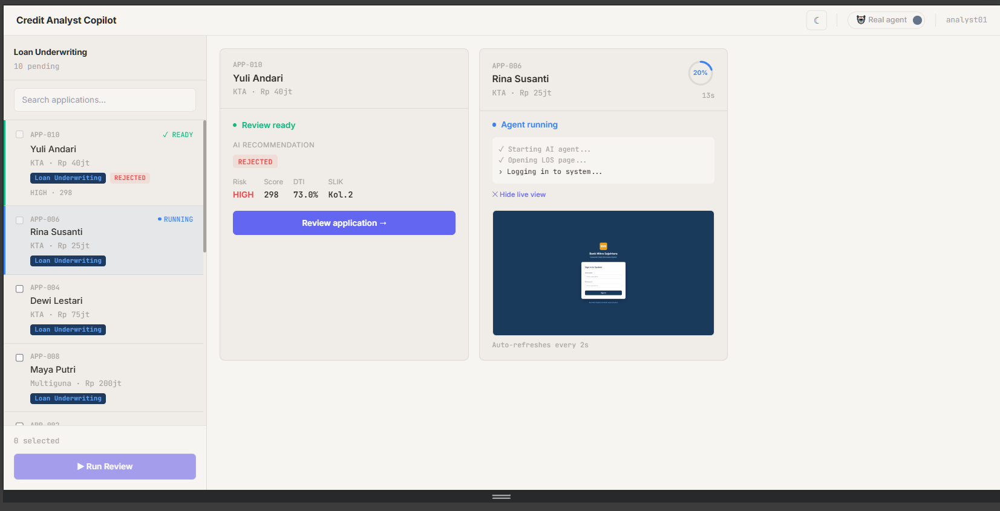

# Credit Analyst Copilot — Hackathon Demo

AI-powered credit analyst assistant that automates loan application review by extracting data from a Loan Origination System (LOS), generating credit memos, and enabling analyst decisions with AI copilot chat.



## What's Inside

| Component | Tech | Port | Description |
|-----------|------|------|-------------|
| **LOS Demo** | React + Bun + SQLite | `3333` | Mock loan origination system with debtor profiles, SLIK OJK, AML/fraud, CRDE scoring |
| **Copilot Dashboard** | React + Bun + WebSocket | `3003` | AI agent orchestration, real-time browser automation, credit memo review, analyst chat |

## Quick Start

### Prerequisites

- [Bun](https://bun.sh) (v1.1+)
- Python 3.11+ (for browser agent — optional, mock mode works without it)

### Option 1: One-Command Start (Windows)

```powershell
.\start-demo.ps1
```

Or via batch:

```batch
start-demo.bat
```

This resets the database and starts both servers.

### Option 2: Manual Start

**Terminal 1 — LOS Demo:**
```bash
bun install
bun run server/db/seed.ts --reset
bun run server/index.ts
```

**Terminal 2 — Copilot Dashboard:**
```bash
cd dashboard
bun install
bun run server/index.ts
```

### Option 3: With `concurrently`

```bash
# Reset DB + start both servers
bun run demo:seed

# Or start without reset
bun run demo
```

## Demo Flow

1. Open **Dashboard** → `http://localhost:3003`
2. Select up to 5 loan applications → click **Run Review**
3. Watch AI agents extract data from LOS in real-time (sim mode = instant)
4. Click **Open & Decide** → review AI-generated credit memo
5. Chat with Copilot for deeper analysis → make final decision

## Configuration

Dashboard settings are editable at `http://localhost:3003/settings` or via `dashboard/.env`:

| Variable | Description |
|----------|-------------|
| `LLM_PROVIDER` | `anthropic`, `gemini`, or `custom` (OpenAI-compatible) |
| `ANTHROPIC_API_KEY` / `ANTHROPIC_MODEL` | Claude credentials |
| `GEMINI_API_KEY` / `GEMINI_MODEL` | Gemini credentials |
| `CUSTOM_LLM_ENDPOINT` / `CUSTOM_LLM_MODEL` / `CUSTOM_LLM_API_KEY` | OpenRouter, Ollama, vLLM, etc. |
| `LOS_URL` | Loan Origination System base URL |
| `LOS_USERNAME` / `LOS_PASSWORD` | LOS login credentials |
| `LOS_LOGIN_PATH` | LOS login page path (default: `/login`) |
| `EXTRACTION_MODE` | `browser` (LLM navigates UI) or `api` (direct REST calls) |
| `MOCK_AGENT` | `true` = no Python, seeded fixtures only |

## Project Structure

```
├── client/                 # LOS Demo frontend
├── server/                 # LOS Demo backend (Bun + SQLite)
├── data/                   # SQLite database (ignored by git)
├── dashboard/
│   ├── client/             # Dashboard frontend
│   ├── server/             # Dashboard backend
│   ├── agent/              # Python browser automation agent
│   └── .env.example        # Config template
├── deploy/                 # Deployment guides (AWS, GCP, Vercel, etc.)
└── design/                 # Wireframes and design assets
```

## Environment Setup

Copy the example env files and fill in your keys:

```bash
cp dashboard/.env.example dashboard/.env
```

Edit `dashboard/.env` with your LLM API keys.

## Tech Stack

- **Runtime:** Bun
- **Frontend:** React 18, React Router, vanilla CSS
- **Backend:** Bun.serve, Bun SQLite
- **Agent:** Python + Playwright + browser-use
- **LLMs:** Anthropic Claude, Google Gemini, or any OpenAI-compatible API

## License

MIT — Hackathon project.
